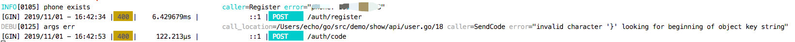
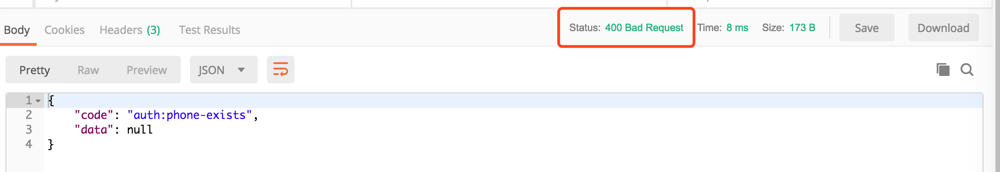

# ZError

[中文文档](./Readme_zh.md)

## Features

- Predefine errors
- Classify errors with groups
- Make error code predefined and standard
- Code Name automaticly generated by group name and error name, which can be customizable
- Automaticly log errors with custom log level, message
- Hide ~~-or not~~ error infos from client
- Wrap error as internal error, identify it and make http code 500
- Automaticly log caller function name, if error is debug level also log code file position
- Standard response format: {"code": "${groupName}:${errorName}", "data": ${interface}}
- Dump all error codes and corresponding infos(descriptions, http code, etc) as json format

## Examples:

see in examples directory

## Result Show:

log result show:

***

response show:

## Why is zerror made

I want errors to be clearly organized and resuable and classified in groups

I want hide erors from client and return code instead, clients use code to do interactive things

I want to respond predefined code and log error in one line code

so Zerror is here

